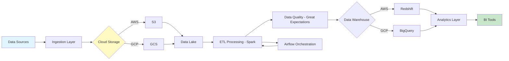
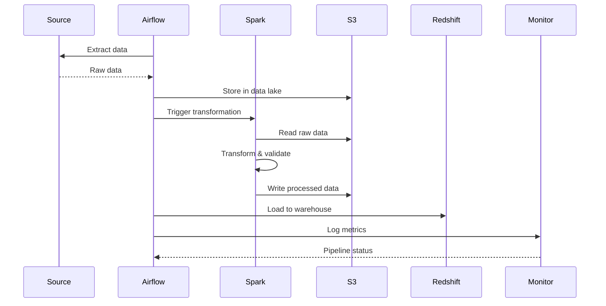

# Cloud Data Engineering Pipeline

<div align="center">


**Scalable cloud data pipeline with ETL, orchestration, and data warehousing on AWS/GCP**

[English](#english) | [Português](#português)

</div>

---

## English

## 📊 Cloud Data Pipeline Architecture



## 🔄 ETL Pipeline Flow




### 📋 Overview

Production-grade cloud data engineering pipeline implementing ETL/ELT processes on AWS and GCP. Features include Apache Airflow orchestration, PySpark for big data processing, data lake architecture (S3/GCS), data warehouse (Redshift/BigQuery), streaming (Kinesis/Pub/Sub), and data quality monitoring.

### 🎯 Key Features

- **ETL/ELT**: Automated data extraction, transformation, loading
- **Orchestration**: Apache Airflow DAGs for workflow management
- **Big Data**: PySpark for distributed processing
- **Data Lake**: S3/GCS for raw and processed data storage
- **Data Warehouse**: Redshift/BigQuery for analytics
- **Streaming**: Real-time data ingestion with Kinesis/Pub/Sub
- **Data Quality**: Great Expectations for validation
- **Monitoring**: CloudWatch/Stackdriver integration

### 🚀 Quick Start

```bash
git clone https://github.com/galafis/cloud-data-engineering-pipeline.git
cd cloud-data-engineering-pipeline
pip install -r requirements.txt

# Configure AWS credentials
aws configure

# Deploy infrastructure
terraform apply -var-file=terraform/vars.tfvars

# Run ETL pipeline
python src/etl/run_pipeline.py --config config/pipeline.yaml

# Start Airflow
airflow standalone
```

### 📊 Pipeline Architecture

```
Data Sources → Ingestion (Kinesis/Kafka) → Data Lake (S3/GCS)
                                                  ↓
                                           Spark Processing
                                                  ↓
                                      Data Warehouse (Redshift/BigQuery)
                                                  ↓
                                           Analytics/BI Tools
```

### 👤 Author

**Gabriel Demetrios Lafis**
- GitHub: [@galafis](https://github.com/galafis)

---

## Português

### 📋 Visão Geral

Pipeline de engenharia de dados em nuvem nível produção implementando processos ETL/ELT na AWS e GCP. Recursos incluem orquestração Apache Airflow, PySpark para processamento big data, arquitetura data lake (S3/GCS), data warehouse (Redshift/BigQuery), streaming (Kinesis/Pub/Sub) e monitoramento de qualidade de dados.

### 🎯 Características Principais

- **ETL/ELT**: Extração, transformação e carregamento automatizados de dados
- **Orquestração**: DAGs Apache Airflow para gerenciamento de workflows
- **Big Data**: PySpark para processamento distribuído
- **Data Lake**: S3/GCS para armazenamento de dados brutos e processados
- **Data Warehouse**: Redshift/BigQuery para analytics
- **Streaming**: Ingestão de dados em tempo real com Kinesis/Pub/Sub
- **Qualidade de Dados**: Great Expectations para validação
- **Monitoramento**: Integração CloudWatch/Stackdriver

### 👤 Autor

**Gabriel Demetrios Lafis**
- GitHub: [@galafis](https://github.com/galafis)
