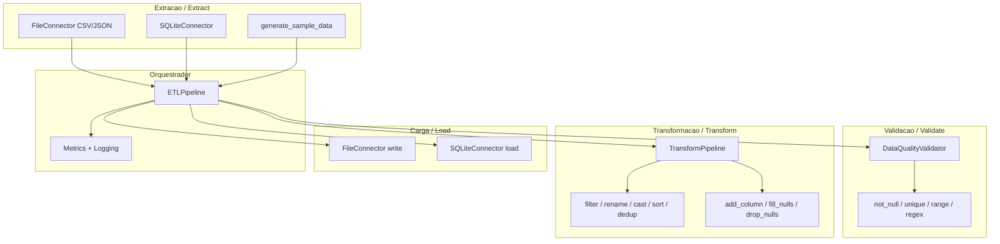
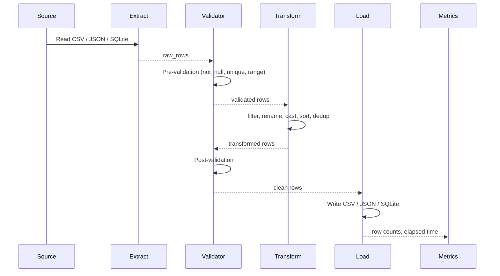

# Cloud Data Engineering Pipeline

[](https://www.python.org/)
[](LICENSE)

Pipeline ETL autocontido com validacao de qualidade de dados, transformacoes composiveis, particionamento, conectores CSV/JSON/SQLite e orquestrador de pipeline com metricas de execucao.

Self-contained ETL pipeline with data quality validation, composable transformations, partitioning, CSV/JSON/SQLite connectors, and pipeline orchestrator with execution metrics.

---

## Arquitetura / Architecture


```mermaid
graph TB
    subgraph Extract["Extracao / Extract"]
        E1[FileConnector CSV/JSON]
        E2[SQLiteConnector]
        E3[generate_sample_data]
    end

    subgraph Validate["Validacao / Validate"]
        V1[DataQualityValidator]
        V2[not_null / unique / range / regex]
    end

    subgraph Transform["Transformacao / Transform"]
        T1[TransformPipeline]
        T2[filter / rename / cast / sort / dedup]
        T3[add_column / fill_nulls / drop_nulls]
    end

    subgraph Load["Carga / Load"]
        L1[FileConnector write]
        L2[SQLiteConnector load]
    end

    subgraph Orchestrate["Orquestrador"]
        O1[ETLPipeline]
        O2[Metrics + Logging]
    end

    E1 --> O1
    E2 --> O1
    E3 --> O1
    O1 --> V1
    V1 --> V2
    O1 --> T1
    T1 --> T2
    T1 --> T3
    O1 --> L1
    O1 --> L2
    O1 --> O2
```

## Fluxo ETL / ETL Flow


```mermaid
sequenceDiagram
    participant Src as Source
    participant Ext as Extract
    participant Val as Validator
    participant Txf as Transform
    participant Ldr as Load
    participant Met as Metrics

    Src->>Ext: Read CSV / JSON / SQLite
    Ext-->>Val: raw_rows
    Val->>Val: Pre-validation (not_null, unique, range)
    Val-->>Txf: validated rows
    Txf->>Txf: filter, rename, cast, sort, dedup
    Txf-->>Val: transformed rows
    Val->>Val: Post-validation
    Val-->>Ldr: clean rows
    Ldr->>Ldr: Write CSV / JSON / SQLite
    Ldr-->>Met: row counts, elapsed time
```

## Funcionalidades / Features

| Funcionalidade / Feature | Descricao / Description |
|---|---|
| DataQualityValidator | Regras not_null, unique, range, regex, custom / Validation rules |
| TransformPipeline | Pipeline composivel de transformacoes / Composable transform pipeline |
| FileConnector | Leitura/escrita CSV e JSON / CSV and JSON I/O |
| SQLiteConnector | Carga e consulta SQLite / SQLite load and query |
| Partitioner | Particionar por valor, hash ou faixa / Partition by value, hash, or range |
| ETLPipeline | Orquestrador ETL com metricas / ETL orchestrator with metrics |
| generate_sample_data | Gerador de dados deterministico / Deterministic data generator |

## Inicio Rapido / Quick Start

```python
from src.etl.pipeline import (
    ETLPipeline, TransformPipeline, DataQualityValidator,
    FileConnector, generate_sample_data
)

# Generate sample data
data = generate_sample_data(1000)

# Build transform pipeline
transforms = (TransformPipeline()
    .filter_rows(lambda r: r["status"] == "active")
    .cast_column("value", float)
    .add_column("category", lambda r: "high" if r["value"] > 500 else "low")
    .sort_by("value", reverse=True))

# Build validator
validator = (DataQualityValidator()
    .add_not_null("id")
    .add_unique("id")
    .add_range("value", 0, 1500))

# Run ETL
pipeline = (ETLPipeline("demo")
    .set_extract(lambda: data)
    .set_transform(transforms)
    .set_validator(validator)
    .set_load(lambda rows: FileConnector.write_csv(rows, "output.csv")))

metrics = pipeline.run()
print(f"Processed {metrics['output_rows']} rows in {metrics['total_seconds']:.3f}s")
```

## Testes / Tests

```bash
pytest tests/ -v
```

## Estrutura / Structure

```
cloud-data-engineering-pipeline/
├── src/
│   └── etl/
│       └── pipeline.py        # Motor ETL / ETL engine
├── tests/
│   └── test_models.py         # Testes unitarios / Unit tests
├── data/
│   ├── raw/
│   └── processed/
├── requirements.txt
└── README.md
```

## Tecnologias / Technologies

- Python 3.9+
- sqlite3 (stdlib)
- pytest

## Licenca / License

MIT License - veja [LICENSE](LICENSE) / see [LICENSE](LICENSE).

## Autor / Author

**Gabriel Demetrios Lafis**
- GitHub: [@galafis](https://github.com/galafis)
